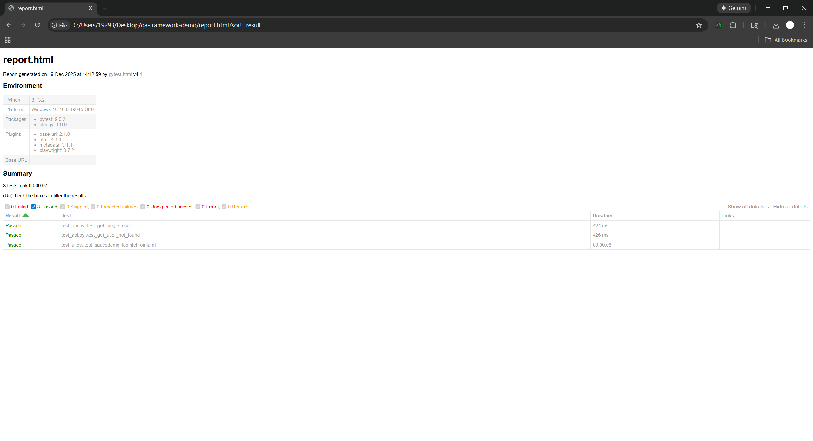

# 🧪 QA Hybrid Automation Framework

A professional test automation framework built with **Python**, **Playwright**, and **Requests**. It handles both **UI** and **API** testing with automated HTML reporting.

## 📊 Test Report Preview
*(Automated HTML report showing 100% pass rate)*



## 🚀 Quick Start

```bash
# 1. Install dependencies
pip install -r requirements.txt
playwright install

# 2. Run tests & Generate Report
pytest --html=report.html --self-contained-html --headed --slowmo 1000
